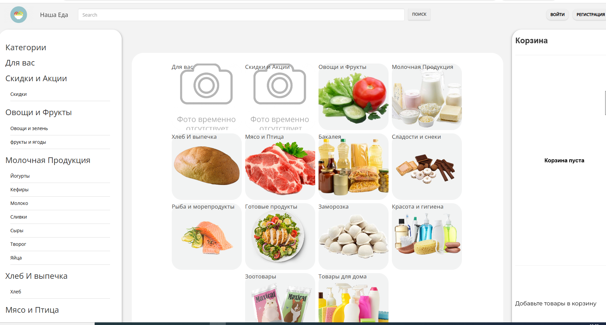

# Дипломный проект Cайт доставки "Наша Еда"

Данный репозиторий представляет собой Дипломный проект,
который является Cайтом доставки.
Данный проект призван показать то что я умею делать с помощью фрейморка django
Проект не имеет коммерческой цели и служит исключительно
для образовательных целей.


## Структура проекта

### Проект состоит из следующих основных приложений:
#
- **users** — управление пользователями (регистрация, авторизация, роли).
 - **products** — управление товарами (каталог, категории, описание).
 - **orders** — оформление и управление заказами.

# Проект реализован как Cайт доставки.

---

## скриншоты страниц 


## Требования и подготовка

 Для работы с проектом рекомендуется использовать виртуальное окружение Python (`venv`).

 ### Предварительные условия

 На вашей системе должны быть установлены:

 - Python 3.12 и выше 
 - pip
 - Django
 - Redis
 - PostgreSQL
---

## Установка и запуск проекта локально

1. Клонируйте репозиторий:

   ```bash
   git clone https://github.com/anor32/OurFood
   cd OurFood
   ```

 2. Создайте и активируйте виртуальное окружение:

 ```bash
  python -m venv venv

   venv\Scripts\activate   
```

3. Установите зависимости:

   ```bash
   pip install -r requirements.txt
   ```

4. Создайте файл `.env` на основе `.env_sample` и заполните необходимые переменные окружения.


5. Создайте базу данных и выполните миграции:

    ```bash
    python manage.py ccdb
    python manage.py makemigrations
   python manage.py migrate
    ```

6. Создайте пользователей с помощью кастомной команды:

   ```bash
   python manage.py ccsu
   ```

7. Загрузите начальные данные из фикстур:

   ```bash
   python -Xutf8 manage.py loaddata backup/products.json
   python -Xutf8 manage.py loaddata backup/users.json
    ```
8. Запустите Redis сервер (если он не запущен):

   ```bash
    redis-server
    ```
9. Запустите Django сервер:

     ```bash
     python manage.py runserver
     ```

---

## Запуск проекта с помощью Docker

### Требования#
 - Docker
 - Docker Compose

 ### Инструкция

### для запуска контейнера пропишите следующую команду
убедитесь что пользователь и данные для входа в базу данных актуальны
поумолчанию создается локальный контейнер подключеный локально к
стандартным порта редиса и postgre

```bash
    docker-compose up -d --build
```


## Дополнительные команды

 - `ccdb` — создание базы данных.
 - `ccsu` — создание пользователей с ролями (user, moderator, admin).
